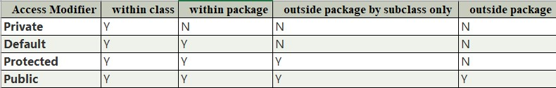

# JDK, JRE & JVM
**Java Development Kit** (JDK) is a software development environment used for developing Java applications and applets. 

It includes:

    - Java Runtime Environment (JRE), 
    
    - Interpreter/loader (Java), 
    
    - Compiler (javac), 
    
    - Archiver (jar), 
    
    - Documentation generator (Javadoc), 
    
    - Other tools needed in Java development.
    
JDK (Java Development Kit) is a Kit that provides the environment to develop and execute(run) the Java program. JDK is a kit(or package) that includes two things

a) Development Tools(to provide an environment to develop your java programs)

b) JRE (to execute your java program).

**JRE** stands for “Java Runtime Environment”
The Java Runtime Environment provides the minimum requirements for executing a Java application; Consists of the Java Virtual Machine (JVM), core classes, and supporting files. 

JRE (Java Runtime Environment) is an installation package that provides an environment to only run(not develop) the java program(or application)onto your machine.

Components of JRE are as follows:

Deployment technologies: Including deployment, Java Web Start, and Java Plug-in.

User interface toolkits: Including Abstract Window Toolkit (AWT), Swing, Java 2D, Image I/O, Print Service, Sound, drag, and drop (DnD).

Integration libraries: Including Interface Definition Language (IDL), Java Database Connectivity (JDBC), Java Naming and Directory Interface (JNDI), Remote Method Invocation (RMI), Remote Method Invocation Over Internet Inter-Orb Protocol (RMI-IIOP), and scripting.

Other base libraries: Including international support, input/output (I/O), extension mechanism, Beans, Java Management Extensions (JMX), Java Native Interface (JNI), Math, Networking, Override Mechanism, Security, Serialization, and Java for XML Processing (XML JAXP).

Lang and util base libraries: Including lang and util, management, versioning, zip, instrument, reflection, Collections, Concurrency Utilities, Java Archive (JAR), Logging, Preferences API, Ref Objects, and Regular Expressions.

Java Virtual Machine (JVM): Including Java HotSpot Client and Server Virtual Machines.

**JVM**, which stands out for java virtual machines. It is as follows:
A specification where the working of Java Virtual Machine is specified. But implementation provider is independent to choose the algorithm. 
Its implementation has been provided by different vendors like Oracle, IBM, Amazon, RedHat and others.
An implementation is a computer program that meets the requirements of the JVM specification.
A Runtime instance of JVM is created, whenever we write a java command on the command prompt to run the java class
JVM is responsible for executing the java program line by line, hence it is also known as an interpreter.

# How JVM Works

JVM(Java Virtual Machine) acts as a run-time engine to run Java applications. JVM is the one that actually calls the main method present in a Java code. JVM is a part of JRE(Java Runtime Environment).

Java applications are called WORA (Write Once Run Anywhere).

On compilation Java compiler generates .class from .java files with same name as in .java file. This .class file goes into various steps when we run it. These steps together describe the whole JVM. 


**Class Loader Subsystem**

Responsible for three activities. 

- Loading

The Class loader reads the “.class” file, generate the corresponding binary data and save it in the method area. For each “.class” file, JVM stores the following information in the method area.

The fully qualified name of the loaded class and its immediate parent class.

Whether the “.class” file is related to Class or Interface or Enum.

Modifier, Variables and Method information etc.

After loading the “.class” file, JVM creates an object of type Class to represent this file in the heap memory. This object is of type Class predefined in java.lang package. 
These Class object can be used by the programmer for getting class level information like the name of the class, parent name, methods and variable information etc. To get this object reference we can use getClass() method of Object class.

- Linking
  
Performs verification, preparation, and (optionally) resolution.

Verification: IEnsures the correctness of the .class file i.e. it checks whether this file is properly formatted and generated by a valid compiler or not. If verification fails, we get run-time exception java.lang.VerifyError. This activity is done by the component ByteCodeVerifier. Once this activity is completed then the class file is ready for compilation.

Preparation: JVM allocates memory for class static variables and initializing the memory to default values. 

Resolution: It is the process of replacing symbolic references from the type with direct references. It is done by searching into the method area to locate the referenced entity.

- Initialization

In this phase, all static variables are assigned with their values defined in the code and static block(if any). This is executed from top to bottom in a class and from parent to child in the class hierarchy. 
In general, there are three class loaders : 

Bootstrap class loader: Every JVM implementation must have a bootstrap class loader, capable of loading trusted classes. It loads core java API classes present in the “JAVA_HOME/jre/lib” directory. This path is popularly known as the bootstrap path. It is implemented in native languages like C, C++.

Extension class loader: It is a child of the bootstrap class loader. It loads the classes present in the extensions directories “JAVA_HOME/jre/lib/ext”(Extension path) or any other directory specified by the java.ext.dirs system property. It is implemented in java by the sun.misc.Launcher$ExtClassLoader class.

System/Application class loader: It is a child of the extension class loader. It is responsible to load classes from the application classpath. It internally uses Environment Variable which mapped to java.class.path. It is also implemented in Java by the sun.misc.Launcher$AppClassLoader class.

JVM follows the `Delegation-Hierarchy principle` to load classes. System class loader delegate load request to extension class loader and extension class loader delegate request to the bootstrap class loader. If a class found in the boot-strap path, the class is loaded otherwise request again transfers to the extension class loader and then to the system class loader. At last, if the system class loader fails to load class, then we get run-time exception java.lang.ClassNotFoundException. 

**JVM Memory**

Method area: In the method area, all class level information like class name, immediate parent class name, methods and variables information etc. are stored, including static variables. There is only one method area per JVM, and it is a shared resource. 

Heap area: Information of all objects is stored in the heap area. There is also one Heap Area per JVM. It is also a shared resource.

Stack area: For every thread, JVM creates one run-time stack which is stored here. Every block of this stack is called activation record/stack frame which stores methods calls. All local variables of that method are stored in their corresponding frame. After a thread terminates, its run-time stack will be destroyed by JVM. It is not a shared resource.

PC Registers: Store address of current execution instruction of a thread. Obviously, each thread has separate PC Registers.

Native method stacks: For every thread, a separate native stack is created. It stores native method information. 

**Execution Engine**

Execution engine executes the “.class” (bytecode). It reads the byte-code line by line, uses data and information present in various memory area and executes instructions. It can be classified into three parts:

Interpreter: It interprets the bytecode line by line and then executes. The disadvantage here is that when one method is called multiple times, every time interpretation is required.

Just-In-Time Compiler(JIT) : It is used to increase the efficiency of an interpreter. It compiles the entire bytecode and changes it to native code so whenever the interpreter sees repeated method calls, JIT provides direct native code for that part so re-interpretation is not required, thus efficiency is improved.

Garbage Collector: It destroys un-referenced objects. For more on Garbage Collector, refer Garbage Collector.

Java Native Interface (JNI) : 

It is an interface that interacts with the Native Method Libraries and provides the native libraries(C, C++) required for the execution. It enables JVM to call C/C++ libraries and to be called by C/C++ libraries which may be specific to hardware.

Native Method Libraries : 

It is a collection of the Native Libraries(C, C++) which are required by the Execution Engine.

# Shallow Copy
- It is fast as no new memory is allocated.
- Changes in one entity is reflected in other entity.
- The default version of the clone() method supports shallow copy.
- A shallow copy is less expensive.
- Cloned object and the original object are not disjoint.
# Deep Copy
- It is slow as new memory is allocated.
- Changes in one entity are not reflected in changes in another identity.
- In order to make the clone() method support the deep copy, one has to override the clone() method.
- Deep copy is highly expensive.
- Cloned object and the original object are disjoint.
# What is the order of execution of instance initialization blocks, static initialization blocks, and constructors?
The order of execution is:
- Static initialization blocks (when the class is loaded).
- Instance initialization blocks (when an instance is created).
- Constructors (after the instance initialization blocks).

```
class Example {
    static int a;
    int b;
    // Static initialization block
    static {
        a = 1;
        System.out.println("Static Initialization Block");
    }
    // Instance initialization block
    {
        b = 2;
        System.out.println("Instance Initialization Block");
    }
    Example() {
        System.out.println("Constructor");
    }
    public static void main(String[] args) {
        new Example();
    }
}
```
Output : 
Static Initialization Block

Instance Initialization Block

Constructor
# What happens if there is an exception in a static initialization block?
If an exception occurs in a static initialization block, it prevents the class from being loaded, resulting in a `ExceptionInInitializerError`. This error occurs the first time the class is accessed.

```
class Example {
    static {
        System.out.println("Static Block");
        if (true) {
            throw new RuntimeException("Exception in static block");
        }
    }
    
    public static void main(String[] args) {
        try {
            new Example();
        } catch (Throwable t) {
            t.printStackTrace();
        }
    }
}
```
Output:

Static Block
java.lang.ExceptionInInitializerError
Caused by: java.lang.RuntimeException: Exception in static block
    at Example.<clinit>(Example.java:6)
# Can you access instance variables in a static initialization block?
No, instance variables cannot be accessed directly in a static initialization block because static blocks do not belong to an instance of the class. They are executed when the class is loaded and no instance exists at that point.
# Can you call a static method in an instance initialization block?
Yes, you can call a static method in an instance initialization block since static methods belong to the class and can be accessed without an instance.
```
class Example {
    static void staticMethod() {
        System.out.println("Static Method");
    }
    
    {
        staticMethod(); // Calling static method
        System.out.println("Instance Block");
    }
    
    Example() {
        System.out.println("Constructor");
    }
    
    public static void main(String[] args) {
        new Example();
    }
}
```
Output:

Static Method

Instance Block

Constructor

``Example`` :
```
class ExampleBlock {
    {
        System.out.println("ExampleBlock : Instance Initialization Block - 1");
    }
    static {
        System.out.println("ExampleBlock : Static Instance Initialization Block - 1");
    }
    ExampleBlock() {
        System.out.println("ExampleBlock : Default Constructor");
    }
}
class SubExampleBlock extends ExampleBlock {
    {
        System.out.println("SubExampleBlock : Instance Initialization Block - 1");
    }
    static {
        System.out.println("SubExampleBlock : Static Instance Initialization Block - 1");
    }
    SubExampleBlock() {
        System.out.println("SubExampleBlock : Default Constructor");
    }
}

public class StaticInitializationBlockEx {
    public static void main(String[] args) {
        ExampleBlock subExampleBlock = new SubExampleBlock();
    }
}
```
Output:

ExampleBlock : Static Instance Initialization Block - 1

SubExampleBlock : Static Instance Initialization Block - 1

ExampleBlock : Instance Initialization Block - 1

ExampleBlock : Default Constructor

SubExampleBlock : Instance Initialization Block - 1

SubExampleBlock : Default Constructor

**Another Example:**

```
public class Superclass {
    {
        System.out.println("Superclass Instance Initialization block");
    }
    static {
        System.out.println("Superclass static Initialization block");
    }
    Superclass() {
        System.out.println("Superclass default constructor");
    }
}
class Subclass extends Superclass {
    {
        System.out.println("Subclass Instance Initialization block");
    }
    static {
        System.out.println("Subclass static Initialization block");
    }
    Subclass() {
        this("hi");
        System.out.println("Subclass default constructor");
    }

    public Subclass(String hi) {
        System.out.println("Subclass parametrized constructor");
    }
}
class Demo {
    public static void main(String[] args) {
        Superclass obj = new Subclass();
    }
}
```
``Output:``

Superclass static Initialization block
Subclass static Initialization block
Superclass Instance Initialization block
Superclass default constructor
Subclass Instance Initialization block
Subclass parametrized constructor
Subclass default constructor

---

### Suppose We Have a Circular Reference (Two Objects That Reference Each Other). Could Such Pair of Objects Become Eligible for Garbage Collection and Why?

Yes, in Java, a pair of objects with a circular reference can become eligible for garbage collection. The eligibility for garbage collection depends on whether the objects are reachable from any live thread or root references in the program. Here’s a detailed explanation:

**Garbage Collection in Java**
Java's garbage collection is based on the concept of reachability. An object is considered reachable if it can be accessed, directly or indirectly, from a set of root references known as GC roots. GC roots include:

References from currently active threads

Static references

References from active methods

**Circular References in Java**
A circular reference occurs when two or more objects reference each other, forming a cycle. For example:

```
class Node {
    Node reference;
}

// Create two nodes that reference each other
Node node1 = new Node();
Node node2 = new Node();
node1.reference = node2;
node2.reference = node1;
```

Here, node1 and node2 reference each other, creating a circular reference.

**Reachability Analysis in Java**
Java's garbage collector (GC) performs reachability analysis to determine which objects can be collected:

- Root Set Identification: The GC starts by identifying a set of root references (GC roots).

- Mark Phase: The GC traverses the object graph, starting from the GC roots, and marks all reachable objects.

- Sweep Phase: The GC identifies objects that are not marked as reachable and reclaims their memory.

**Circular References and Garbage Collection**

Even if node1 and node2 reference each other, they can still become eligible for garbage collection if they are not reachable from any GC roots. Here’s how:

- External References Removed: Suppose the only references to node1 and node2 are their mutual references, and no other object or root references node1 or node2.
  
- Unreachable Cycle: Since no GC root can reach node1 or node2, the entire cycle formed by node1 and node2 is unreachable.

- Eligible for Collection: The garbage collector, upon detecting that node1 and node2 are not reachable from any GC roots, will mark them for collection and reclaim their memory.

```
public class CircularReferenceDemo {
    static class Node {
        Node reference;
    }

    public static void main(String[] args) {
        // Create two nodes that reference each other
        Node node1 = new Node();
        Node node2 = new Node();
        node1.reference = node2;
        node2.reference = node1;

        // Remove external references
        node1 = null;
        node2 = null;

        // At this point, node1 and node2 are only reachable through each other.
        // Java's garbage collector will detect this circular reference and collect the objects.
    }
}
```

In this example, after setting `node1` and `node2` to `null`, the objects they referenced are no longer reachable from any GC roots. Despite the circular reference, Java’s garbage collector can detect that node1 and node2 are unreachable and will collect them.

In summary, in Java, circular references do not prevent garbage collection. The garbage collector is capable of detecting cycles of unreachable objects and reclaiming their memory. The key factor is reachability from GC roots. If the objects involved in the circular reference are not reachable from any GC roots, they will be collected, regardless of their mutual references.

# Access Modifier


