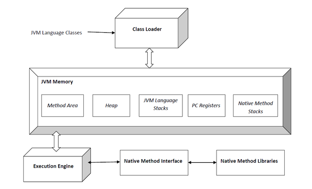
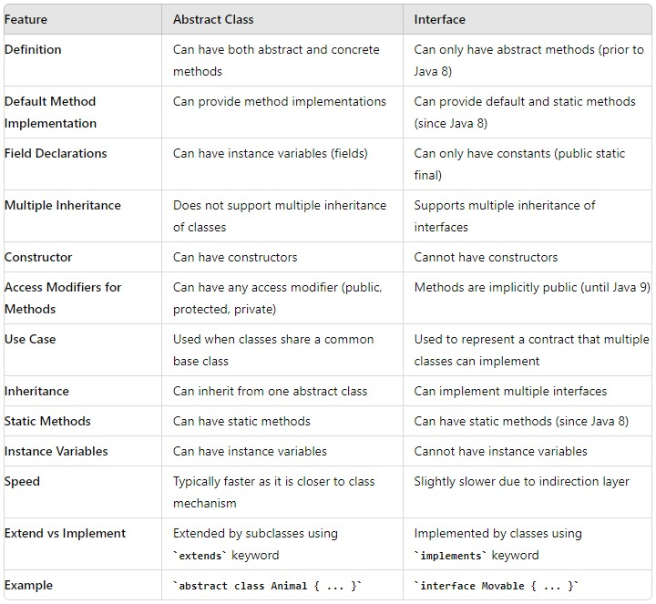
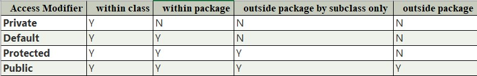

# JDK, JRE & JVM
**Java Development Kit** (JDK) is a software development environment used for developing Java applications and applets. 

It includes:

    - Java Runtime Environment (JRE), 
    
    - Interpreter/loader (Java), 
    
    - Compiler (javac), 
    
    - Archiver (jar), 
    
    - Documentation generator (Javadoc), 
    
    - Other tools needed in Java development.
    
JDK (Java Development Kit) is a Kit that provides the environment to develop and execute(run) the Java program. JDK is a kit(or package) that includes two things

a) Development Tools(to provide an environment to develop your java programs)

b) JRE (to execute your java program).

**JRE** stands for “Java Runtime Environment”
The Java Runtime Environment provides the minimum requirements for executing a Java application; Consists of the Java Virtual Machine (JVM), core classes, and supporting files. 

JRE (Java Runtime Environment) is an installation package that provides an environment to only run(not develop) the java program(or application)onto your machine.

Components of JRE are as follows:

Deployment technologies: Including deployment, Java Web Start, and Java Plug-in.

User interface toolkits: Including Abstract Window Toolkit (AWT), Swing, Java 2D, Image I/O, Print Service, Sound, drag, and drop (DnD).

Integration libraries: Including Interface Definition Language (IDL), Java Database Connectivity (JDBC), Java Naming and Directory Interface (JNDI), Remote Method Invocation (RMI), Remote Method Invocation Over Internet Inter-Orb Protocol (RMI-IIOP), and scripting.

Other base libraries: Including international support, input/output (I/O), extension mechanism, Beans, Java Management Extensions (JMX), Java Native Interface (JNI), Math, Networking, Override Mechanism, Security, Serialization, and Java for XML Processing (XML JAXP).

Lang and util base libraries: Including lang and util, management, versioning, zip, instrument, reflection, Collections, Concurrency Utilities, Java Archive (JAR), Logging, Preferences API, Ref Objects, and Regular Expressions.

Java Virtual Machine (JVM): Including Java HotSpot Client and Server Virtual Machines.

**JVM**, which stands out for java virtual machines. It is as follows:
A specification where the working of Java Virtual Machine is specified. But implementation provider is independent to choose the algorithm. 
Its implementation has been provided by different vendors like Oracle, IBM, Amazon, RedHat and others.
An implementation is a computer program that meets the requirements of the JVM specification.
A Runtime instance of JVM is created, whenever we write a java command on the command prompt to run the java class
JVM is responsible for executing the java program line by line, hence it is also known as an interpreter.

---
# How JVM Works

JVM(Java Virtual Machine) acts as a run-time engine to run Java applications. JVM is the one that actually calls the main method present in a Java code. JVM is a part of JRE(Java Runtime Environment).

Java applications are called WORA (Write Once Run Anywhere).

On compilation Java compiler generates .class from .java files with same name as in .java file. This .class file goes into various steps when we run it. These steps together describe the whole JVM. 



**Class Loader Subsystem**

Responsible for three activities. 

- Loading

The Class loader reads the “.class” file, generate the corresponding binary data and save it in the method area. For each “.class” file, JVM stores the following information in the method area.

The fully qualified name of the loaded class and its immediate parent class.

Whether the “.class” file is related to Class or Interface or Enum.

Modifier, Variables and Method information etc.

After loading the “.class” file, JVM creates an object of type Class to represent this file in the heap memory. This object is of type Class predefined in java.lang package. 
These Class object can be used by the programmer for getting class level information like the name of the class, parent name, methods and variable information etc. To get this object reference we can use getClass() method of Object class.

- Linking
  
Performs verification, preparation, and (optionally) resolution.

Verification: Ensures the correctness of the .class file i.e. it checks whether this file is properly formatted and generated by a valid compiler or not. If verification fails, we get run-time exception java.lang.VerifyError. This activity is done by the component ByteCodeVerifier. Once this activity is completed then the class file is ready for compilation.

Preparation: JVM allocates memory for class static variables and initializing the memory to default values. 

Resolution: It is the process of replacing symbolic references from the type with direct references. It is done by searching into the method area to locate the referenced entity.

- Initialization

In this phase, all static variables are assigned with their values defined in the code and static block(if any). This is executed from top to bottom in a class and from parent to child in the class hierarchy. 
In general, there are three class loaders : 

Bootstrap class loader: Every JVM implementation must have a bootstrap class loader, capable of loading trusted classes. It loads core java API classes present in the “JAVA_HOME/jre/lib” directory. This path is popularly known as the bootstrap path. It is implemented in native languages like C, C++.

Extension class loader: It is a child of the bootstrap class loader. It loads the classes present in the extensions directories “JAVA_HOME/jre/lib/ext”(Extension path) or any other directory specified by the java.ext.dirs system property. It is implemented in java by the sun.misc.Launcher$ExtClassLoader class.

System/Application class loader: It is a child of the extension class loader. It is responsible to load classes from the application classpath. It internally uses Environment Variable which mapped to java.class.path. It is also implemented in Java by the sun.misc.Launcher$AppClassLoader class.

JVM follows the `Delegation-Hierarchy principle` to load classes. System class loader delegate load request to extension class loader and extension class loader delegate request to the bootstrap class loader. If a class found in the boot-strap path, the class is loaded otherwise request again transfers to the extension class loader and then to the system class loader. At last, if the system class loader fails to load class, then we get run-time exception java.lang.ClassNotFoundException. 

**JVM Memory**

Method area: In the method area, all class level information like class name, immediate parent class name, methods and variables information etc. are stored, including static variables. There is only one method area per JVM, and it is a shared resource. 

Heap area: Information of all objects is stored in the heap area. There is also one Heap Area per JVM. It is also a shared resource.

Stack area: For every thread, JVM creates one run-time stack which is stored here. Every block of this stack is called activation record/stack frame which stores methods calls. All local variables of that method are stored in their corresponding frame. After a thread terminates, its run-time stack will be destroyed by JVM. It is not a shared resource.

PC Registers: Store address of current execution instruction of a thread. Obviously, each thread has separate PC Registers.

Native method stacks: For every thread, a separate native stack is created. It stores native method information. 

**Execution Engine**

Execution engine executes the “.class” (bytecode). It reads the byte-code line by line, uses data and information present in various memory area and executes instructions. It can be classified into three parts:

Interpreter: It interprets the bytecode line by line and then executes. The disadvantage here is that when one method is called multiple times, every time interpretation is required.

Just-In-Time Compiler(JIT) : It is used to increase the efficiency of an interpreter. It compiles the entire bytecode and changes it to native code so whenever the interpreter sees repeated method calls, JIT provides direct native code for that part so re-interpretation is not required, thus efficiency is improved.

Garbage Collector: It destroys un-referenced objects. For more on Garbage Collector, refer Garbage Collector.

Java Native Interface (JNI) : 

It is an interface that interacts with the Native Method Libraries and provides the native libraries(C, C++) required for the execution. It enables JVM to call C/C++ libraries and to be called by C/C++ libraries which may be specific to hardware.

Native Method Libraries : 

It is a collection of the Native Libraries(C, C++) which are required by the Execution Engine.

---
# ClassNotFoundException vs NoClassDefFoundError
In Java, both `ClassNotFoundException` and `NoClassDefFoundError` are related to issues with class loading, but they occur in different scenarios and have different causes. Here’s a detailed explanation of each, along with examples:

**ClassNotFoundException**
- What is it?

  ClassNotFoundException is a `checked exception` that occurs when an application tries to load a class through its fully qualified name (e.g., using `Class.forName()`, `ClassLoader.loadClass()`, or `ClassLoader.findSystemClass()`) and the class cannot be found in the classpath.

- When does it occur?

  This exception typically occurs at runtime when the specified class is not available in the classpath.

```
public class ClassNotFoundExceptionExample {
    public static void main(String[] args) {
        try {
            // Attempt to load a class that doesn't exist
            Class.forName("com.example.NonExistentClass");
        } catch (ClassNotFoundException e) {
            System.out.println("ClassNotFoundException caught: " + e.getMessage());
        }
    }
}
Output:
ClassNotFoundException caught: com.example.NonExistentClass
```

**NoClassDefFoundError**

- What is it?

  NoClassDefFoundError is an unchecked error (a subclass of LinkageError) that occurs when the Java Virtual Machine (JVM) or a classloader tries to load the definition of a class (i.e., during the linking phase when the class has been referenced by another class) and the definition of the class is not found.

- When does it occur? This error typically occurs when a class was present during the compile-time, but for some reason, it is not available during the runtime. It can also occur if a class is not properly initialized.

```
public class NoClassDefFoundErrorExample {
    public static void main(String[] args) {
        try {
            ExampleClass example = new ExampleClass();
            example.printMessage();
        } catch (NoClassDefFoundError e) {
            System.out.println("NoClassDefFoundError caught: " + e.getMessage());
        }
    }
}

class ExampleClass {
    static {
        // Simulate class initialization failure
        if (true) {
            throw new RuntimeException("Simulated class initialization failure");
        }
    }

    public void printMessage() {
        System.out.println("Hello, world!");
    }
}
Output:
Exception in thread "main" java.lang.ExceptionInInitializerError
Caused by: java.lang.RuntimeException: Simulated class initialization failure
    at ExampleClass.<clinit>(NoClassDefFoundErrorExample.java:13)
    at NoClassDefFoundErrorExample.main(NoClassDefFoundErrorExample.java:6)
```

Key Differences
Type:

- ClassNotFoundException is a checked exception.
- NoClassDefFoundError is an unchecked error.

When it Occurs:

- ClassNotFoundException occurs when a class is dynamically loaded (e.g., using Class.forName()) and is not found in the classpath.
- NoClassDefFoundError occurs when a class that was present at compile-time is not found at runtime or fails to initialize properly.

Cause:

- ClassNotFoundException is often due to a missing class in the classpath when attempting to load it dynamically.
- NoClassDefFoundError is often due to a classpath issue where the class is not found when the JVM or classloader tries to load it, or due to a failure in static initialization blocks.

---
# Shallow Copy
- It is fast as no new memory is allocated.
- Changes in one entity is reflected in other entity.
- The default version of the clone() method supports shallow copy.
- A shallow copy is less expensive.
- Cloned object and the original object are not disjoint.
# Deep Copy
- It is slow as new memory is allocated.
- Changes in one entity are not reflected in changes in another identity.
- In order to make the clone() method support the deep copy, one has to override the clone() method.
- Deep copy is highly expensive.
- Cloned object and the original object are disjoint.

---
# Abstract Class VS Interface


Definition:

- Abstract Class: A class that cannot be instantiated on its own and can include both abstract methods (without a body) and concrete methods (with a body).
- Interface: A reference type in Java that can contain only constants, method signatures, default methods, static methods, and nested types. Method bodies exist only for default and static methods.

Default Method Implementation:

- Abstract Class: Can provide implementations for some methods, which can be used by subclasses.
- Interface: From Java 8 onwards, interfaces can have default and static methods with implementations.

Field Declarations:

- Abstract Class: Can have fields with various access modifiers.
- Interface: Fields are implicitly public, static, and final.

Multiple Inheritance:

- Abstract Class: Java does not support multiple inheritance for classes, so a class can only extend one abstract class.
- Interface: A class can implement multiple interfaces.

Constructor:

- Abstract Class: Can have constructors that can be called when an instance of a subclass is created.
- Interface: Cannot have constructors.

Access Modifiers for Methods:

- Abstract Class: Methods can have any access modifier.
- Interface: Methods are implicitly public (up to Java 8). From Java 9 onwards, methods can have private access modifier.

Use Case:

- Abstract Class: Used when you have a base class with common code that should be shared across multiple related classes.
- Interface: Used to define a contract that multiple classes can implement, often for unrelated classes.

Inheritance:

- Abstract Class: A class can extend only one abstract class.
- Interface: A class can implement multiple interfaces, promoting flexibility.

Static Methods:

- Abstract Class: Can include static methods.
- Interface: Can include static methods since Java 8.

Instance Variables:

- Abstract Class: Can have instance variables.
- Interface: Cannot have instance variables; can only have constants.

Speed:

- Abstract Class: Generally faster due to being closer to the class mechanism.
- Interface: May introduce a slight performance overhead due to the indirection layer.

Extend vs Implement:

- Abstract Class: Use the `extends` keyword.
- Interface: Use the `implements` keyword.

---
# What is the order of execution of instance initialization blocks, static initialization blocks, and constructors?
The order of execution is:
- Static initialization blocks (when the class is loaded).
- Instance initialization blocks (when an instance is created).
- Constructors (after the instance initialization blocks).

```
class Example {
    static int a;
    int b;
    // Static initialization block
    static {
        a = 1;
        System.out.println("Static Initialization Block");
    }
    // Instance initialization block
    {
        b = 2;
        System.out.println("Instance Initialization Block");
    }
    Example() {
        System.out.println("Constructor");
    }
    public static void main(String[] args) {
        new Example();
    }
}
```
Output : 
Static Initialization Block

Instance Initialization Block

Constructor

---
# What happens if there is an exception in a static initialization block?
If an exception occurs in a static initialization block, it prevents the class from being loaded, resulting in a `ExceptionInInitializerError`. This error occurs the first time the class is accessed.

```
class Example {
    static {
        System.out.println("Static Block");
        if (true) {
            throw new RuntimeException("Exception in static block");
        }
    }
    
    public static void main(String[] args) {
        try {
            new Example();
        } catch (Throwable t) {
            t.printStackTrace();
        }
    }
}
```
Output:

Static Block
java.lang.ExceptionInInitializerError
Caused by: java.lang.RuntimeException: Exception in static block
    at Example.<clinit>(Example.java:6)
# Can you access instance variables in a static initialization block?
No, instance variables cannot be accessed directly in a static initialization block because static blocks do not belong to an instance of the class. They are executed when the class is loaded and no instance exists at that point.
# Can you call a static method in an instance initialization block?
Yes, you can call a static method in an instance initialization block since static methods belong to the class and can be accessed without an instance.
```
class Example {
    static void staticMethod() {
        System.out.println("Static Method");
    }
    
    {
        staticMethod(); // Calling static method
        System.out.println("Instance Block");
    }
    
    Example() {
        System.out.println("Constructor");
    }
    
    public static void main(String[] args) {
        new Example();
    }
}
```
Output:

Static Method

Instance Block

Constructor

``Example`` :
```
class ExampleBlock {
    {
        System.out.println("ExampleBlock : Instance Initialization Block - 1");
    }
    static {
        System.out.println("ExampleBlock : Static Instance Initialization Block - 1");
    }
    ExampleBlock() {
        System.out.println("ExampleBlock : Default Constructor");
    }
}
class SubExampleBlock extends ExampleBlock {
    {
        System.out.println("SubExampleBlock : Instance Initialization Block - 1");
    }
    static {
        System.out.println("SubExampleBlock : Static Instance Initialization Block - 1");
    }
    SubExampleBlock() {
        System.out.println("SubExampleBlock : Default Constructor");
    }
}

public class StaticInitializationBlockEx {
    public static void main(String[] args) {
        ExampleBlock subExampleBlock = new SubExampleBlock();
    }
}
```
Output:

ExampleBlock : Static Instance Initialization Block - 1

SubExampleBlock : Static Instance Initialization Block - 1

ExampleBlock : Instance Initialization Block - 1

ExampleBlock : Default Constructor

SubExampleBlock : Instance Initialization Block - 1

SubExampleBlock : Default Constructor

**Another Example:**

```
public class Superclass {
    {
        System.out.println("Superclass Instance Initialization block");
    }
    static {
        System.out.println("Superclass static Initialization block");
    }
    Superclass() {
        System.out.println("Superclass default constructor");
    }
}
class Subclass extends Superclass {
    {
        System.out.println("Subclass Instance Initialization block");
    }
    static {
        System.out.println("Subclass static Initialization block");
    }
    Subclass() {
        this("hi");
        System.out.println("Subclass default constructor");
    }

    public Subclass(String hi) {
        System.out.println("Subclass parametrized constructor");
    }
}
class Demo {
    public static void main(String[] args) {
        Superclass obj = new Subclass();
    }
}
```
``Output:``

Superclass static Initialization block

Subclass static Initialization block

Superclass Instance Initialization block

Superclass default constructor

Subclass Instance Initialization block

Subclass parametrized constructor

Subclass default constructor

---

### Suppose We Have a Circular Reference (Two Objects That Reference Each Other). Could Such Pair of Objects Become Eligible for Garbage Collection and Why?

Yes, in Java, a pair of objects with a circular reference can become eligible for garbage collection. The eligibility for garbage collection depends on whether the objects are reachable from any live thread or root references in the program. Here’s a detailed explanation:

**Garbage Collection in Java**
Java's garbage collection is based on the concept of reachability. An object is considered reachable if it can be accessed, directly or indirectly, from a set of root references known as GC roots. GC roots include:

References from currently active threads

Static references

References from active methods

**Circular References in Java**
A circular reference occurs when two or more objects reference each other, forming a cycle. For example:

```
class Node {
    Node reference;
}

// Create two nodes that reference each other
Node node1 = new Node();
Node node2 = new Node();
node1.reference = node2;
node2.reference = node1;
```

Here, node1 and node2 reference each other, creating a circular reference.

**Reachability Analysis in Java**
Java's garbage collector (GC) performs reachability analysis to determine which objects can be collected:

- Root Set Identification: The GC starts by identifying a set of root references (GC roots).

- Mark Phase: The GC traverses the object graph, starting from the GC roots, and marks all reachable objects.

- Sweep Phase: The GC identifies objects that are not marked as reachable and reclaims their memory.

**Circular References and Garbage Collection**

Even if node1 and node2 reference each other, they can still become eligible for garbage collection if they are not reachable from any GC roots. Here’s how:

- External References Removed: Suppose the only references to node1 and node2 are their mutual references, and no other object or root references node1 or node2.
  
- Unreachable Cycle: Since no GC root can reach node1 or node2, the entire cycle formed by node1 and node2 is unreachable.

- Eligible for Collection: The garbage collector, upon detecting that node1 and node2 are not reachable from any GC roots, will mark them for collection and reclaim their memory.

```
public class CircularReferenceDemo {
    static class Node {
        Node reference;
    }

    public static void main(String[] args) {
        // Create two nodes that reference each other
        Node node1 = new Node();
        Node node2 = new Node();
        node1.reference = node2;
        node2.reference = node1;

        // Remove external references
        node1 = null;
        node2 = null;

        // At this point, node1 and node2 are only reachable through each other.
        // Java's garbage collector will detect this circular reference and collect the objects.
    }
}
```

In this example, after setting `node1` and `node2` to `null`, the objects they referenced are no longer reachable from any GC roots. Despite the circular reference, Java’s garbage collector can detect that node1 and node2 are unreachable and will collect them.

In summary, in Java, circular references do not prevent garbage collection. The garbage collector is capable of detecting cycles of unreachable objects and reclaiming their memory. The key factor is reachability from GC roots. If the objects involved in the circular reference are not reachable from any GC roots, they will be collected, regardless of their mutual references.

---
# Access Modifier



---
# How do you implement custom annotations in Java?
Annotations provide metadata about the code and can be used for various purposes such as compilation instructions, runtime processing, and documentation.
Implementing custom annotations in Java involves several steps: defining the annotation, specifying its target, retention policy, and using it in code.

1. Define the Annotation

Annotations are defined using the @interface keyword. You can specify elements within the annotation that act like attributes.

```
import java.lang.annotation.ElementType;
import java.lang.annotation.Retention;
import java.lang.annotation.RetentionPolicy;
import java.lang.annotation.Target;

// Define the annotation
@Retention(RetentionPolicy.RUNTIME) // Specifies that the annotation will be available at runtime
@Target(ElementType.METHOD) // Specifies that the annotation can be applied to methods
public @interface MyCustomAnnotation {
    String value();
}
```
2. Use the Annotation

You can apply the annotation to methods, classes, or fields depending on the specified target.
```
public class MyClass {

    @MyCustomAnnotation(value = "Hello, World!")
    public void myMethod() {
        System.out.println("This is my method.");
    }

    public static void main(String[] args) {
        MyClass obj = new MyClass();
        obj.myMethod();
    }
}
```

3. Process the Annotation

To process annotations at runtime, you typically use reflection.
```
import java.lang.reflect.Method;

public class AnnotationProcessor {

    public static void main(String[] args) {
        MyClass obj = new MyClass();

        // Get all methods of MyClass
        Method[] methods = obj.getClass().getMethods();

        // Iterate through all methods
        for (Method method : methods) {
            // Check if the method is annotated with MyCustomAnnotation
            if (method.isAnnotationPresent(MyCustomAnnotation.class)) {
                // Get the annotation
                MyCustomAnnotation annotation = method.getAnnotation(MyCustomAnnotation.class);
                // Print the value of the annotation
                System.out.println("Method " + method.getName() + " has annotation value: " + annotation.value());
            }
        }
    }
}
```

Summary

- Define the annotation: Use @interface, specify the retention policy and target.
  
- Use the annotation: Apply the annotation to methods, classes, or fields.
  
- Process the annotation: Use reflection to read and process the annotation values.

---
# What is the Optional class in Java 8 and how is it used?

The `Optional` class in Java 8 is a container object used to represent the presence or absence of a value. It is a more expressive alternative to using `null` to indicate that a value is missing. `Optional` helps to avoid `NullPointerException` and provides a clear way to handle situations where a value may be absent.

**Key Methods of the Optional Class**

Here are some of the main methods provided by the Optional class:

`empty()`: Returns an empty Optional instance.

`of(T value)`: Returns an Optional with the specified present non-null value.

`ofNullable(T value)`: Returns an Optional describing the specified value, if non-null, otherwise returns an empty Optional.

`isPresent()`: Returns true if there is a value present, otherwise false.

`ifPresent(Consumer<? super T> consumer)`: If a value is present, performs the given action with the value, otherwise does nothing.

`orElse(T other)`: Returns the value if present, otherwise returns other.

`orElseGet(Supplier<? extends T> other)`: Returns the value if present, otherwise invokes and returns the result produced by the supplying function.

`orElseThrow(Supplier<? extends X> exceptionSupplier)`: Returns the contained value, if present, otherwise throws an exception to be created by the provided supplier.

Examples of Using Optional

Creating an Optional
```
import java.util.Optional;

public class OptionalExample {

    public static void main(String[] args) {
        // Creating an Optional with a non-null value
        Optional<String> optionalValue = Optional.of("Hello, World!");
        
        // Creating an empty Optional
        Optional<String> emptyOptional = Optional.empty();
        
        // Creating an Optional that can hold a null value
        Optional<String> nullableOptional = Optional.ofNullable(null);
    }
}
```
Using Optional Methods
```
import java.util.Optional;

public class OptionalExample {

    public static void main(String[] args) {
        Optional<String> optionalValue = Optional.of("Hello, World!");

        // Check if value is present
        if (optionalValue.isPresent()) {
            System.out.println("Value is present: " + optionalValue.get());
        }

        // Using ifPresent to perform an action if value is present
        optionalValue.ifPresent(value -> System.out.println("Value using ifPresent: " + value));

        // Using orElse to provide a default value if Optional is empty
        String defaultValue = optionalValue.orElse("Default Value");
        System.out.println("Value or default: " + defaultValue);

        // Using orElseGet to provide a value using a Supplier if Optional is empty
        String suppliedValue = optionalValue.orElseGet(() -> "Supplied Value");
        System.out.println("Value or supplied: " + suppliedValue);

        // Using orElseThrow to throw an exception if Optional is empty
        try {
            String exceptionValue = optionalValue.orElseThrow(() -> new IllegalArgumentException("Value is not present"));
            System.out.println("Value or exception: " + exceptionValue);
        } catch (IllegalArgumentException e) {
            System.out.println(e.getMessage());
        }
    }
}
```

Summary

`Optional` is a container object which may or may not contain a non-null value.

It provides methods to handle the presence or absence of values explicitly.

It helps in avoiding `NullPointerException` and makes the code more readable and expressive.

---
# Profiling
**Profiling** and optimizing a Java application involves identifying performance bottlenecks, understanding memory usage, and making adjustments to improve overall performance.

1. Profiling a Java Application

Profiling involves monitoring the application to gather performance data. This can be done using various tools:

a. Java VisualVM

Java VisualVM is a tool that provides detailed information about Java applications while they are running.

Install Java VisualVM: It's bundled with the JDK under the bin directory (as jvisualvm).

Start VisualVM: Run the jvisualvm command from your JDK's bin directory.

Attach to the Running Application: In the VisualVM interface, locate your running Java application and attach to it.

Monitor CPU and Memory Usage: Use the CPU and Memory tabs to monitor performance metrics.

Analyze Heap Dumps: Take heap dumps to analyze memory usage and detect memory leaks.

Profile CPU and Memory: Use the Profiler tab to start profiling CPU and memory usage. This helps identify which methods consume the most resources.

b. JProfiler

JProfiler is a commercial profiling tool with extensive features for profiling Java applications.

Download and Install JProfiler: Obtain it from the official website.

Integrate with Your Application: Start your application with JProfiler's integration.

Analyze Performance: Use JProfiler's interface to monitor CPU, memory, threads, and more.

Heap Dumps and CPU Profiling: Capture and analyze heap dumps, and profile CPU usage to identify hotspots.

2. Common Profiling Metrics

CPU Usage: Identify methods or threads consuming excessive CPU time.

Memory Usage: Detect memory leaks and analyze heap usage.

Thread Analysis: Monitor thread states and detect deadlocks or excessive blocking.

Garbage Collection: Analyze GC pauses and adjust GC settings.

3. Optimization Techniques

Once profiling identifies the bottlenecks, optimization involves improving the identified areas.

a. Code Optimization

Optimize Hotspots: Refactor or optimize methods consuming the most CPU time.

Efficient Data Structures: Use appropriate data structures for your use case (e.g., `ArrayList` vs `LinkedList`).

Algorithm Optimization: Improve algorithms for better time complexity.

b. Memory Management

Avoid Memory Leaks: Ensure proper object references are cleared and finalize methods are avoided.

Efficient Object Creation: Reuse objects when possible and avoid unnecessary object creation.

Tune JVM Options: Adjust JVM options like `-Xms`, `-Xmx`, and garbage collector settings (`-XX:+UseG1GC`, etc.).

c. Concurrency Optimization

Reduce Contention: Use concurrent collections and reduce synchronized blocks.

Thread Pool Management: Properly configure thread pools to match the workload.

Avoid Blocking: Use non-blocking algorithms and structures where possible.

d. Database Optimization

Efficient Queries: Optimize SQL queries and use indexes effectively.

Connection Pooling: Use connection pools to manage database connections efficiently.

Batch Processing: Process data in batches to reduce the number of database calls.

Profiling and optimizing a Java application is an iterative process:

Profile the Application: Use tools like Java VisualVM, JProfiler, or YourKit to identify bottlenecks.

Analyze Data: Focus on CPU, memory, thread usage, and GC pauses.

Apply Optimizations: Refactor code, optimize memory usage, tune JVM settings, improve concurrency, and optimize database interactions.

Re-profile and Validate: After making changes, re-profile the application to ensure the optimizations have the desired effect.

This process helps in maintaining a performant and efficient Java application.

---
# Explain how garbage collection tuning can improve application performance.

**Garbage collection** tuning involves adjusting JVM parameters to optimize memory management, such as setting heap size, choosing the right garbage collector algorithm, and configuring generation sizes. Proper tuning can reduce GC pauses and improve throughput, and decrease latency.

Here's an overview of how GC tuning can improve performance with examples.

**1. Understanding Garbage Collection**

The JVM has several garbage collectors, each suited to different types of applications. The most common are:

Serial Garbage Collector (`-XX:+UseSerialGC`): Best for single-threaded environments or small heap sizes.

Parallel Garbage Collector (`-XX:+UseParallelGC`): Suitable for multi-threaded applications with a focus on throughput.

CMS (Concurrent Mark-Sweep) Garbage Collector (`-XX:+UseConcMarkSweepGC`): Reduces pause times by doing most of the GC work concurrently.

G1 Garbage Collector (`-XX:+UseG1GC`): Designed for applications with large heaps and a focus on predictable pause times.

**2. Tuning Garbage Collection**

a. Selecting the Right Garbage Collector

Choosing the right garbage collector based on application characteristics can improve performance.

Example:

Parallel GC for Throughput: Use for applications requiring high throughput.

`java -XX:+UseParallelGC -jar MyApp.jar`

G1 GC for Low Pause Times: Use for applications requiring low pause times and predictable performance.
`java -XX:+UseG1GC -jar MyApp.jar`

b. Tuning Heap Size

Setting appropriate initial and maximum heap sizes can prevent frequent resizing and improve GC efficiency.
`java -Xms2g -Xmx2g -jar MyApp.jar`

c. Tuning Young and Old Generation Sizes

Adjusting the sizes of the young and old generations can optimize GC performance based on object allocation patterns.

Example:
- Setting Young Generation Size:
`java -Xmn512m -Xms2g -Xmx2g -jar MyApp.jar`

d. Tuning GC Frequency and Pause Times

GC tuning involves balancing the frequency of garbage collection and the duration of GC pauses.

Example:

G1 GC with Pause Time Goals:
`java -XX:+UseG1GC -XX:MaxGCPauseMillis=200 -jar MyApp.jar`

**3. Examples of GC Tuning**

Example 1: High Throughput Application

Scenario: An application with high throughput requirements and large heap usage.

Tuning Steps:

- Select Parallel GC:
`java -XX:+UseParallelGC -Xms4g -Xmx4g -jar HighThroughputApp.jar`

- Adjust GC Threads:
`java -XX:+UseParallelGC -XX:ParallelGCThreads=8 -Xms4g -Xmx4g -jar HighThroughputApp.jar`

- Monitor and Adjust: Use GC logs to monitor performance and adjust settings.
`java -XX:+UseParallelGC -XX:ParallelGCThreads=8 -Xms4g -Xmx4g -XX:+PrintGCDetails -XX:+PrintGCDateStamps -Xloggc:gc.log -jar HighThroughputApp.jar`

Example 2: Low Latency Application
Scenario: An application requiring low latency and predictable pause times.

Tuning Steps:

Select G1 GC: `java -XX:+UseG1GC -Xms2g -Xmx2g -jar LowLatencyApp.jar`

Set Pause Time Goals: `java -XX:+UseG1GC -XX:MaxGCPauseMillis=100 -Xms2g -Xmx2g -jar LowLatencyApp.jar`

Adjust Heap Regions: `java -XX:+UseG1GC -XX:MaxGCPauseMillis=100 -XX:G1HeapRegionSize=16m -Xms2g -Xmx2g -jar LowLatencyApp.jar`

Monitor and Adjust: Use GC logs to monitor and fine-tune.
`java -XX:+UseG1GC -XX:MaxGCPauseMillis=100 -XX:G1HeapRegionSize=16m -Xms2g -Xmx2g -XX:+PrintGCDetails -XX:+PrintGCDateStamps -Xloggc:gc.log -jar LowLatencyApp.jar`

Example 3: Real-time Analytics Application

Scenario: An application requiring both high throughput and low pause times.

Tuning Steps:

Select CMS GC: `java -XX:+UseConcMarkSweepGC -Xms3g -Xmx3g -jar RealTimeAnalyticsApp.jar`

Reduce Initial Mark Pause: `java -XX:+UseConcMarkSweepGC -XX:CMSInitiatingOccupancyFraction=70 -XX:+UseCMSInitiatingOccupancyOnly -Xms3g -Xmx3g -jar RealTimeAnalyticsApp.jar`

Monitor and Adjust: Use GC logs to monitor and adjust. `java -XX:+UseConcMarkSweepGC -XX:CMSInitiatingOccupancyFraction=70 -XX:+UseCMSInitiatingOccupancyOnly -Xms3g -Xmx3g -XX:+PrintGCDetails -XX:+PrintGCDateStamps -Xloggc:gc.log -jar RealTimeAnalyticsApp.jar`

**4. Monitoring and Profiling**

Monitoring Tools:

Java VisualVM: Monitor GC activity and memory usage.

JConsole: Real-time monitoring of memory, threads, and GC.

GC Logs: Analyze GC logs to identify patterns and tune settings.

---
# Why Wait, Notify, and NotifyAll are in Object Class

In Java, the `wait()`, `notify()`, and `notifyAll()` methods are part of the Object class rather than the Thread class. This design choice stems from the fact that these methods are used for communication between threads that are synchronized on the same object. Here’s a detailed explanation:

1. Synchronization on Objects

Synchronization: In Java, threads can synchronize on any object. This means that any object can be used as a monitor (a mutual exclusion lock).
Object-level Synchronization: Since synchronization happens at the object level, it makes sense to place the methods that control waiting and notifying on the Object class.

2. Thread Communication

Shared Resource: The wait(), notify(), and notifyAll() methods are used to coordinate access to a shared resource. The resource is represented by an object, not a thread.
Wait/Notify Mechanism: When a thread calls wait(), it must hold the lock on the object and will release the lock until it is notified. Another thread must call notify() or notifyAll() on the same object to wake up the waiting thread(s).

3. Flexibility

Any Object as Monitor: By placing these methods in the Object class, Java allows any object to be used as a monitor. This provides greater flexibility compared to restricting synchronization mechanisms to threads only.

4. Conceptual Consistency

Locks and Monitors: The concept of locks and monitors in concurrent programming is associated with objects, not threads. Threads are the entities that perform actions, while objects are the entities on which actions are performed.

Consistency in Synchronization: Keeping wait(), notify(), and notifyAll() in the Object class maintains consistency, as these methods are directly related to the intrinsic lock associated with each object.

Example to Illustrate the Concept

Here’s an example that demonstrates why wait(), notify(), and notifyAll() are in the Object class:
```
class SharedResource {
    public synchronized void waitForCondition() throws InterruptedException {
        while (!condition) {
            wait();
        }
    }

    public synchronized void changeCondition() {
        condition = true;
        notify();
    }

    private boolean condition = false;
}

public class WaitNotifyExample {
    public static void main(String[] args) {
        SharedResource sharedResource = new SharedResource();

        Thread t1 = new Thread(() -> {
            try {
                sharedResource.waitForCondition();
                System.out.println("Condition met, thread 1 proceeding.");
            } catch (InterruptedException e) {
                Thread.currentThread().interrupt();
            }
        });

        Thread t2 = new Thread(() -> {
            try {
                Thread.sleep(1000); // Simulate some work
                sharedResource.changeCondition();
                System.out.println("Condition changed, thread 2 notifying.");
            } catch (InterruptedException e) {
                Thread.currentThread().interrupt();
            }
        });

        t1.start();
        t2.start();
    }
}
```
In this example:

wait() and notify() are called on the sharedResource object.

The SharedResource object acts as the monitor.

The threads (t1 and t2) synchronize on the sharedResource object.

Summary

Object-level Synchronization: Synchronization in Java is at the object level, so methods for thread communication (wait(), notify(), notifyAll()) are in the Object class.

Shared Resource Coordination: These methods are used to coordinate access to shared resources, which are represented by objects.

Flexibility and Consistency: Placing these methods in the Object class provides flexibility and maintains consistency with the concept of intrinsic locks and monitors.

**Important Point:**

We call wait (), notify () or notifyAll method in Java from synchronized method or synchronized block in Java to avoid:

1) IllegalMonitorStateException in Java which will occur if we don't call wait (), notify () or notifyAll () method from synchronized context.

2) Any potential race condition between wait and notify method in Java.

---
# Why String is immutable in java

The immutability of the String class in Java is a fundamental design choice that brings several benefits in terms of security, performance, and usability. Here are the primary reasons why String is immutable in Java:

1. Security

Sensitive Data Handling: Strings are often used to handle sensitive data like usernames, passwords, and URLs. If strings were mutable, it would be easy for a malicious actor to modify their content, leading to potential security breaches.

Example:
`String password = "secretPassword";
// If String was mutable, another piece of code could alter the password.`

2. String Pooling

Java uses a special memory region called the String Pool to store string literals. When a new string is created, the JVM checks the pool to see if the string already exists. If it does, the new reference points to the existing string. This reduces memory usage and improves performance.

Example:
`String s1 = "Hello";
String s2 = "Hello";
// Both s1 and s2 reference the same object in the string pool.`

3. Thread Safety

Immutability inherently provides thread safety. Since strings cannot be changed once created, there is no risk of concurrent modifications, making them safe to use across multiple threads without synchronization.

Example:
`public void threadSafeExample() {
    String sharedString = "Shared";
    // Multiple threads can use sharedString without causing data inconsistency.
}`

4. Performance

Caching Hash Code: Since the content of a string never changes, Java caches the hash code of the string after it is computed for the first time. This makes string operations, like lookups in hash-based collections (e.g., HashMap), faster.

Example:
`String s = "example";
int hashCode = s.hashCode(); // The hash code is cached for future use.`

5. Consistency and Predictability

Immutability ensures that a string remains constant and predictable throughout its lifetime. This simplifies reasoning about code behavior and helps prevent bugs.

Example:
`String original = "Original";
String copy = original;
original = "Modified";
// The copy still holds the value "Original".`

6. Used in Key Classes

Strings are used as keys in many important Java classes, such as HashMap, Hashtable, and HashSet. Immutability ensures that the key's hash code remains consistent, which is crucial for the correct behavior of these data structures.

Example:
`Map<String, String> map = new HashMap<>();
map.put("key", "value");
// The key's hash code remains consistent, ensuring correct behavior of the map.`

The immutability of the `String` class in Java is a deliberate design choice that offers multiple benefits, including enhanced security, better memory management through string pooling, inherent thread safety, improved performance, and predictable behavior. By making strings immutable, Java ensures that they can be used safely and efficiently in a wide range of applications.

---
# What is the difference between wait() and sleep() in Java?

`wait()` is used in synchronized context to release the lock and wait until notified, while `sleep()` pauses the thread execution for a specified time without releasing the lock.

---
# What is a thread pool and why is it used?
A thread pool is a collection of pre-instantiated reusable threads that can execute tasks, improving performance by reducing the overhead of creating and destroying threads.

---
# Map vs FlatMap
- `map()` and `flatMap()` both returns Stream<R>.
- `map()` produces one output value for one input value whereas `flatMap()` provide one or more values for each input value. In simple words, a map is for transformation while flatmap is a combination of transformation and flattening.
  flatMap() = map()+flattening

---
# How can you implement a custom ClassLoader in Java, and what are the potential use cases?

To implement a custom ClassLoader in Java, you typically extend the ClassLoader class and override the findClass() method. This method is called after the parent ClassLoader fails to find the class in its classpath.

The key steps typically include the following: 

- Convert the binary name of the class to a file name. 
- Read that file into a byte array. 
- Call defineClass() to convert the byte array into a Class object.

Use cases for a custom ClassLoader could include:

- Loading classes dynamically from sources other than the classpath, such as a network location or a database.
- Implementing hot-swapping of classes in a running JVM.
- Isolating or sandboxing specific parts of an application by controlling class loading behavior.

Creating a custom ClassLoader should be done with caution due to the complexity involved.

---
# How would you implement security in a Java backend application?

Implementing security in a Java backend application involves multiple layers and aspects to ensure data protection, secure communication, and robust authentication and authorization mechanisms. Here’s a comprehensive approach to implementing security in a Java backend application:

**1. Secure Coding Practices**

- Input Validation: Always validate and sanitize user inputs to prevent SQL injection, XSS, and other injection attacks.
- Output Encoding: Encode outputs to prevent XSS attacks.
- Exception Handling: Avoid exposing stack traces or error messages that might reveal implementation details.

**2. Authentication**

- Username and Password Authentication: Implement strong authentication mechanisms using secure hashing algorithms like bcrypt, PBKDF2, or Argon2.
- JWT (JSON Web Tokens): Use JWT for stateless authentication. Ensure tokens are signed and optionally encrypted.
- OAuth2/OpenID Connect: Implement OAuth2 for authorization and OpenID Connect for authentication to integrate with third-party identity providers.

**3. Authorization**

- Role-based Access Control (RBAC): Use RBAC to restrict access to resources based on user roles.
- Attribute-based Access Control (ABAC): For more complex scenarios, use ABAC where access decisions are based on attributes of users, resources, and the environment.

Example using Spring Security with RBAC:
```
@Override
protected void configure(HttpSecurity http) throws Exception {
    http.authorizeRequests()
        .antMatchers("/admin/**").hasRole("ADMIN")
        .antMatchers("/user/**").hasAnyRole("USER", "ADMIN")
        .anyRequest().authenticated()
        .and()
        .formLogin()
        .and()
        .logout();
}
```

**4. Secure Communication**

- HTTPS: Use HTTPS to encrypt data in transit.
- TLS Configuration: Configure strong TLS settings to prevent attacks such as POODLE, BEAST, and Heartbleed.

```
server:
  ssl:
    enabled: true
    key-store: classpath:keystore.jks
    key-store-password: changeit
    key-password: changeit
```

**5. Data Protection**

- Encryption: Encrypt sensitive data both at rest and in transit using strong encryption algorithms.
- Secure Storage: Use secure methods to store credentials, such as encrypted databases or secrets management systems like HashiCorp Vault.

Example of encrypting sensitive data:
```
import javax.crypto.Cipher;
import javax.crypto.KeyGenerator;
import javax.crypto.SecretKey;
import javax.crypto.spec.SecretKeySpec;

public class EncryptionUtil {
    private static final String ALGORITHM = "AES";

    public static byte[] encrypt(String data, SecretKey key) throws Exception {
        Cipher cipher = Cipher.getInstance(ALGORITHM);
        cipher.init(Cipher.ENCRYPT_MODE, key);
        return cipher.doFinal(data.getBytes());
    }

    public static String decrypt(byte[] data, SecretKey key) throws Exception {
        Cipher cipher = Cipher.getInstance(ALGORITHM);
        cipher.init(Cipher.DECRYPT_MODE, key);
        return new String(cipher.doFinal(data));
    }
}
```

**6. Security Headers**

HTTP Security Headers: Add security headers like Content-Security-Policy (CSP), X-Content-Type-Options, X-Frame-Options, and X-XSS-Protection.

Example using Spring Security:
```
@Override
protected void configure(HttpSecurity http) throws Exception {
    http.headers()
        .contentSecurityPolicy("default-src 'self'; script-src 'self' 'unsafe-inline'")
        .and()
        .frameOptions().sameOrigin()
        .and()
        .xssProtection().block(false);
}
```

**7. Logging and Monitoring**

- Audit Logging: Implement audit logging to track access to sensitive resources and operations.
- Intrusion Detection: Use monitoring tools to detect and respond to security incidents.

**8. Security Testing**

- Static Code Analysis: Use tools like SonarQube to perform static code analysis and detect security vulnerabilities.
- Dynamic Analysis: Use tools like OWASP ZAP or Burp Suite for dynamic analysis to identify runtime vulnerabilities.
- Penetration Testing: Conduct regular penetration testing to identify and address security weaknesses.

**9. Secure Development Lifecycle**

- Security Reviews: Incorporate security reviews at each stage of the development lifecycle.
- Security Training: Provide security training to developers to ensure they follow best practices.

Summmary:

Implementing security in a Java backend application involves a multi-layered approach, including secure coding practices, robust authentication and authorization mechanisms, secure communication, data protection, security headers, logging and monitoring, security testing, and adherence to a secure development lifecycle. By following these practices, we can build a secure Java backend application that protects sensitive data and resists various types of attacks.
