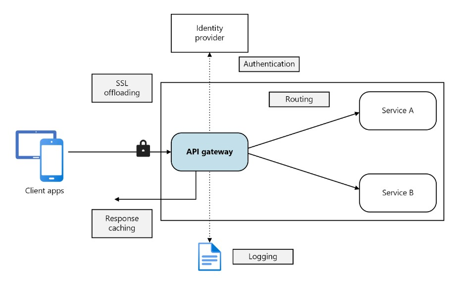

# Principles of Microservices Architecture

Microservices architecture is an architectural style that structures an application as a collection of loosely coupled services. Each service is highly maintainable, testable, independently deployable, and organized around business capabilities. Here are the key principles of microservices architecture:

**1. Single Responsibility Principle** : Each microservice should have a single, well-defined purpose and should perform one specific function or a small group of related functions. This helps to ensure that services remain small, manageable, and focused.

**2. Decentralized Data Management** : Microservices favor decentralized data management, meaning each service manages its own database. This avoids the complexities and performance issues associated with a single, centralized database.

**3. Independent Deployability** : Microservices can be developed, deployed, and scaled independently. This allows for continuous deployment and faster iterations since changes to one service do not require the redeployment of the entire application.

**4. API-based Communication** : Services communicate with each other through well-defined APIs, typically over HTTP/REST or messaging queues. This ensures clear, decoupled interactions between services.

**5. Decentralized Governance** : Microservices architecture supports decentralized governance, allowing teams to choose the best tools and technologies for their specific needs. This encourages innovation and the use of the right tool for the right job.

**6. Automated Deployment and DevOps** : Automated deployment processes and DevOps practices are essential for managing microservices. Continuous integration and continuous deployment (CI/CD) pipelines help streamline the deployment process, reduce errors, and improve deployment frequency.

**7. Failure Isolation** : Microservices are designed to handle failure gracefully. The failure of one service should not impact the entire system. Techniques such as circuit breakers, retries, and failover mechanisms are often used to achieve this.

**8. Polyglot Programming** : Microservices architecture allows the use of different programming languages, frameworks, and technologies for different services. This flexibility enables teams to use the best tools for their specific needs.

**9. Business Capability Alignment** : Each microservice should align with a specific business capability, making it easier to evolve and scale the system in response to changing business requirements.

**10. Scalability** : Microservices can be scaled independently. If a particular service requires more resources due to increased demand, it can be scaled out without affecting other services.

**11. Organized around Business Capabilities** : Teams are cross-functional, organized around business capabilities, and own the lifecycle of the service. This aligns the development process with business objectives and improves overall efficiency.

**12. Event-Driven Architecture** : Microservices often use event-driven architecture for asynchronous communication between services. This can improve performance and resilience by decoupling services and enabling them to react to events in real-time.

---

Querying data from multiple databases in a microservices architecture can be challenging due to the decentralized data management principle. However, several strategies and patterns can be employed to effectively query and aggregate data from multiple microservices:

**1. API Composition**
API Composition involves an API gateway or a dedicated service that calls multiple microservices and aggregates the results. This approach is suitable for simple aggregations and read operations.

- API Gateway: Acts as a single entry point for client requests, orchestrating calls to multiple microservices and aggregating the results.
- Backend for Frontend (BFF): A specific type of API gateway tailored to the needs of a particular client interface.
```
@RestController
public class CompositeController {
    
    @Autowired
    private ServiceAClient serviceAClient;
    
    @Autowired
    private ServiceBClient serviceBClient;
    
    @GetMapping("/composite")
    public CompositeResponse getCompositeData() {
        DataA dataA = serviceAClient.getDataA();
        DataB dataB = serviceBClient.getDataB();
        return new CompositeResponse(dataA, dataB);
    }
}
```

**2. Database Per Service with Data Replication**

Each microservice owns its own database, but certain data can be replicated across services to reduce the need for cross-service queries.

- Event-Driven Data Replication: Use an event-driven architecture to replicate data between services. Services publish events when their data changes, and other services subscribe to these events to update their own data stores.

```
// Service A publishes an event
public void updateDataA(DataA dataA) {
    dataRepository.save(dataA);
    eventPublisher.publishEvent(new DataAUpdatedEvent(dataA));
}

// Service B listens for the event
@EventListener
public void handleDataAUpdated(DataAUpdatedEvent event) {
    dataBRepository.updateWithDataA(event.getDataA());
}
```
**3. CQRS (Command Query Responsibility Segregation)**

CQRS separates the read and write operations, allowing for optimized data retrieval and updates. Read models can aggregate data from multiple sources.

- Command Side: Handles write operations.
- Query Side: Handles read operations, often using a different data model optimized for queries.

```
// Command Handler
public class CreateOrderCommandHandler {
    public void handle(CreateOrderCommand command) {
        // Handle command logic
    }
}

// Query Handler
public class OrderQueryHandler {
    public OrderDTO getOrder(String orderId) {
        // Retrieve data from multiple sources and aggregate
        Order order = orderRepository.findById(orderId);
        Customer customer = customerRepository.findByOrderId(orderId);
        return new OrderDTO(order, customer);
    }
}
```
4. Database Views and Joins
In some cases, you can use database views or federated queries to aggregate data from multiple databases, especially if using a multi-model database that supports such operations.

Federated Queries: Queries that span multiple databases, often used in data warehousing.

5. GraphQL
GraphQL can be used as an API layer to aggregate data from multiple microservices. It allows clients to request exactly the data they need and can efficiently compose data from multiple sources.

Note : Querying data from multiple databases in a microservices architecture requires careful planning and design. The choice of strategy depends on the specific requirements, such as the need for real-time data, the complexity of the queries, and the consistency requirements. Using a combination of API composition, data replication, CQRS, federated queries, and GraphQL can help achieve efficient and scalable data retrieval across multiple microservices.

---
# Bounded Contexts in Microservices

Bounded contexts are a `core concept in Domain-Driven Design (DDD)` and play a crucial role in the architecture of microservices. They `help in defining clear boundaries` within which a particular `domain model is valid and consistent`, ensuring that each microservice has a well-defined scope and responsibility.

A bounded context `represents a specific responsibility` and area of a larger domain. Within a bounded context, all models, logic, and data are `consistent` and follow the same rules. It `helps to avoid ambiguity and conflicts` that might arise from having multiple models and interpretations of the same concepts in different parts of the system.

**Benefits of Bounded Contexts in Microservices**

- Clear Boundaries: Ensures that each microservice has a clear, well-defined responsibility.
- Modularity: Promotes modularity and independence between services, allowing easier maintenance and scalability.
- Consistency: Maintains consistency within each bounded context by avoiding the overlap of domain logic and data.
- Decoupling: Encourages loose coupling between different parts of the system, making the overall architecture more flexible and resilient to changes.

**Bounded Contexts in a Banking Trading System**

In a banking trading system, the application can be divided into several bounded contexts, each representing a distinct area of functionality. Here are some examples of bounded contexts:

**1. Trade Execution Context**:
- Responsibility: Handling the execution of trades.
- Entities: Trade, Order, ExecutionReport.
- Services: TradeExecutionService, OrderService.

**2. Risk Management Context**:
- Responsibility: Managing risk associated with trades.
- Entities: RiskAssessment, Position, Exposure.
- Services: RiskAssessmentService, PositionService.

**3. Settlement Context**:
- Responsibility: Settling trades after execution.
- Entities: Settlement, Payment, Ledger.
- Services: SettlementService, PaymentService.

**4. Market Data Context**:
- Responsibility: Providing market data such as prices and rates.
- Entities: MarketData, Price, Rate.
- Services: MarketDataService, PriceService.

**5. Compliance Context**:
- Responsibility: Ensuring trades comply with regulatory requirements.
- Entities: ComplianceCheck, Report, AuditTrail.
- Services: ComplianceService, ReportingService.

Interactions Between Bounded Contexts

Each bounded context operates independently but may need to interact with other contexts. This interaction is typically managed through well-defined APIs or asynchronous messaging (events).

Example Interaction:

Trade Execution and Risk Management:

When a trade is executed, the TradeExecutionService publishes a TradeExecutedEvent.

The RiskAssessmentService subscribes to this event to assess the risk of the new trade.

Trade Execution Context:
```
public class TradeExecutionService {
    private final TradeRepository tradeRepository;
    private final EventPublisher eventPublisher;

    public TradeExecutionService(TradeRepository tradeRepository, EventPublisher eventPublisher) {
        this.tradeRepository = tradeRepository;
        this.eventPublisher = eventPublisher;
    }

    public void executeTrade(Trade trade) {
        tradeRepository.save(trade);
        eventPublisher.publish(new TradeExecutedEvent(trade));
    }
}
```
Risk Management Context:
```
public class RiskAssessmentService {
    private final PositionRepository positionRepository;
    private final RiskCalculator riskCalculator;

    @EventListener
    public void handleTradeExecuted(TradeExecutedEvent event) {
        Trade trade = event.getTrade();
        Position position = positionRepository.findByTrade(trade);
        riskCalculator.calculateRisk(position);
    }
}
```

---
# What are some of the most important considerations when designing a RESTful API?

There are several important considerations when designing a RESTful API, 

including URL structure, 

HTTP methods, 

media types, 

hypermedia links and data formats. 

The URL structure is very important because it determines how users access the API. I prefer using URLs that are easy for humans to read so they can understand the purpose of the resource. 

HTTP methods are also important because they determine which actions are available on the API. For example, if there’s no POST method, then users cannot create new resources. 

Media types are important because they define the format of the data being sent or received. 

Hypermedia links are important because they allow users to navigate between different resources without having to know all possible routes beforehand.

---
# API Gateway
An API Gateway is a key component in system design, particularly in microservices architectures and modern web applications. It serves as a centralized entry point for managing and routing requests from clients to the appropriate microservices or backend services within a system.


API Gateway is a service that sits between clients and backend services, acting as a reverse proxy to accept incoming requests from clients, perform various operations such as routing, authentication, and rate limiting, and then forward those requests to the appropriate backend services.
_It serves as a single entry point for clients to access multiple services, providing a unified interface and abstracting the complexities of the underlying architecture._

Here’s how it works:

- Step 1 : Routing
When a client sends a request to the API Gateway, it first examines the request to determine which service or microservice should handle it. This routing can be based on various criteria such as the URL path, HTTP method, or headers.
- Step 2 : Protocol translation
The API Gateway can translate incoming requests from one protocol to another. For example, it can accept HTTP requests from clients and convert them to gRPC or WebSocket requests for backend services.
- Step 3 : Request aggregation
In some cases, a client may need to fetch data from multiple services to fulfill a single request. The API Gateway can aggregate these requests into a single call to improve efficiency and reduce the number of round trips.
- Step 4 : Authentication and authorization
The API Gateway can handle authentication and authorization for incoming requests. It can verify the identity of the client and check if the client has the necessary permissions to access the requested resources.
- Step 5 : Rate limiting and throttling
To prevent abuse and ensure fair usage of resources, the API Gateway can enforce rate limiting and throttling policies. It can limit the number of requests a client can make within a certain time period.
- Step 6 : Load balancing
The API Gateway can distribute incoming requests across multiple instances of a service to ensure high availability and scalability.
- Step 7 : Caching
To improve performance, the API Gateway can cache responses from backend services and serve them directly to clients for subsequent identical requests.
- Step 8 : Monitoring and logging
The API Gateway can collect metrics and logs for incoming requests, providing insights into the usage and performance of the system.

Overall, the API Gateway simplifies the client-server communication by providing a centralized entry point with various features to manage and secure the interactions between clients and backend services.

**Below are the best practices for API Gateway**:

- Security: Implement strong authentication and authorization mechanisms, use SSL/TLS for encryption, and apply rate limiting and IP whitelisting to protect against abuse.
- Performance Optimization: Use caching, request/response compression, and efficient routing to reduce latency and improve response times.
- Scalability: Design for horizontal scalability, use load balancing, and monitor performance metrics to scale resources as needed.
- Monitoring and Logging: Implement comprehensive logging, use monitoring tools to track performance metrics, and integrate with logging and monitoring systems for centralized management.
- Error Handling: Implement robust error handling mechanisms and use standardized error codes and messages for consistency.
- Versioning and Documentation: Use versioning to manage changes and maintain backward compatibility, and keep up-to-date documentation for developers to understand how to use the API.

**Benefits of using an API Gateway**

- Centralized Entry Point
An API Gateway acts as a single entry point, meaning that clients send their requests to the gateway, and the gateway takes responsibility for routing those requests to the appropriate services.

- Routing and Load Balancing
API Gateways analyze incoming requests and determine which backend service should handle them based on various factors such as the request’s URL, headers, or even the content of the request.

Additionally, they can distribute incoming requests evenly across multiple instances of the same service to ensure load balancing.

- Authentication and Authorization
They can enforce authentication, ensuring that only authorized users or applications can access the services behind the gateway.

- Request and Response Transformation
API Gateways can transform requests and responses as they pass through.

For example, they can convert data formats (e.g., from JSON to XML or vice versa) to ensure compatibility between different parts of the system.

They can also aggregate data from multiple services into a single response, providing clients with a unified view.

**Challenges of using an API Gateway**

API Gateways can introduce several challenges, especially in complex environments or when not properly configured. Some common challenges include:

- Performance bottlenecks: API Gateways can become a single point of failure or a performance bottleneck, especially when handling a large number of requests. Careful design and configuration are required to ensure they can handle the load.
- Increased latency: Introducing an API Gateway can add additional latency to requests, especially if it needs to perform complex routing, authentication, or other operations. Optimizing the Gateway’s configuration and using caching can help mitigate this issue.
- Complexity: Managing and configuring an API Gateway can be complex, especially in environments with a large number of services and endpoints. Proper documentation and automation tools can help reduce this complexity.
- Security risks: Misconfigured API Gateways can introduce security vulnerabilities, such as improper authentication, authorization, or exposure of sensitive information. Regular security audits and updates are essential to mitigate these risks.
- Scalability challenges: Scaling an API Gateway can be challenging, especially in dynamic environments with fluctuating traffic. Load balancing and horizontal scaling strategies are essential to ensure scalability.
- Monitoring and logging: Monitoring and logging the API Gateway’s performance and behavior can be complex, especially when dealing with a large number of requests and services. Proper monitoring and logging tools are crucial for maintaining visibility into the Gateway’s operation.

---
# JWT
JWT (JSON Web Token) is an open standard (RFC 7519) for securely transmitting information between parties as a JSON object. This information can be verified and trusted because it is digitally signed. JWTs can be signed using a secret (with the HMAC algorithm) or a public/private key pair using RSA or ECDSA.

**JWT is used for authorization and information exchange.**
1. Authorization: This is the most common scenario for using JWT. Once the user is logged in, each subsequent request will include the JWT, allowing the user to access routes, services, and resources that are permitted with that token.
2. Information Exchange: JWTs are a good way to securely transmit information between parties. Since JWTs can be signed, the information is trusted and verified.

**When to Use JWT**
1. Stateless Authentication: JWT is ideal for stateless authentication where the server does not need to maintain session information. Each request from the client contains the JWT, which the server can validate and then grant access accordingly.
2. Scalability: When building scalable applications, especially in microservices architectures, JWT helps in maintaining stateless authentication across different services.
3. Mobile and Single Page Applications (SPA): JWT is commonly used in mobile apps and SPAs where maintaining a session on the server is not feasible.

**When Not to Use JWT**
1. Sensitive Data: Do not use JWT to store sensitive data directly, as it is only base64url encoded, not encrypted.
2. Large Payloads: If the payload is too large, it will increase the size of the token, which can cause performance issues, especially in network latency.
3. Short-Lived Information: If the data is very short-lived and constantly changing, it might not be ideal to use JWT.

**How JWT Works**

A JWT is composed of three parts: Header, Payload, and Signature.

- Header: Contains metadata about the token, such as the type of token (JWT) and the signing algorithm (e.g., HMAC SHA256 or RSA).
- Payload: Contains the claims, which are statements about an entity (typically, the user) and additional data. Claims are typically statements about a resource (like user ID or roles).
- Signature: Used to verify that the sender of the JWT is who it says it is and to ensure that the message wasn’t changed along the way. The signature is created by taking the encoded header, the encoded payload, a secret, and the algorithm specified in the header, and signing that.

```
    +-------------------+       +------------------+       +-------------------+
    |                   |       |                  |       |                   |
    |     Header        |  +--> |     Payload      |  +--> |     Signature     |
    |                   |       |                  |       |                   |
    +-------------------+       +------------------+       +-------------------+
          Base64Url                    Base64Url                    Signature
        Encode Header               Encode Payload             Sign with Secret
```

**Using JWT in Spring Application**
To use JWT in a Spring application, you typically need to follow these steps:

- Add Dependencies: Include necessary dependencies like spring-boot-starter-security, jjwt (Java JWT: JSON Web Token for Java and Android).
- Configure Security: Set up a security configuration class to enable JWT authentication.
- JWT Utility Class: Create a utility class for generating and validating JWT tokens.
- Custom Filters: Implement custom filters for JWT authentication and authorization.
- Controller: Secure your endpoints using annotations like @PreAuthorize or @Secured.

Example in Spring Boot
```
// build.gradle
dependencies {
    implementation 'org.springframework.boot:spring-boot-starter-security'
    implementation 'io.jsonwebtoken:jjwt:0.9.1'
}

// SecurityConfig.java
@EnableWebSecurity
public class SecurityConfig extends WebSecurityConfigurerAdapter {
    @Override
    protected void configure(HttpSecurity http) throws Exception {
        http.csrf().disable()
            .authorizeRequests()
            .antMatchers("/authenticate").permitAll()
            .anyRequest().authenticated()
            .and()
            .addFilterBefore(new JwtRequestFilter(), UsernamePasswordAuthenticationFilter.class);
    }
}

// JwtUtil.java
public class JwtUtil {
    private String secret = "secret";

    public String generateToken(String username) {
        return Jwts.builder()
                .setSubject(username)
                .setIssuedAt(new Date(System.currentTimeMillis()))
                .setExpiration(new Date(System.currentTimeMillis() + 1000 * 60 * 60 * 10))
                .signWith(SignatureAlgorithm.HS256, secret)
                .compact();
    }

    public String extractUsername(String token) {
        return Jwts.parser().setSigningKey(secret).parseClaimsJws(token).getBody().getSubject();
    }

    public Boolean validateToken(String token, UserDetails userDetails) {
        final String username = extractUsername(token);
        return (username.equals(userDetails.getUsername()) && !isTokenExpired(token));
    }
}

// JwtRequestFilter.java
public class JwtRequestFilter extends OncePerRequestFilter {
    @Autowired
    private UserDetailsService userDetailsService;

    @Autowired
    private JwtUtil jwtUtil;

    @Override
    protected void doFilterInternal(HttpServletRequest request, HttpServletResponse response, FilterChain chain)
            throws ServletException, IOException {
        final String authorizationHeader = request.getHeader("Authorization");

        String username = null;
        String jwt = null;

        if (authorizationHeader != null && authorizationHeader.startsWith("Bearer ")) {
            jwt = authorizationHeader.substring(7);
            username = jwtUtil.extractUsername(jwt);
        }

        if (username != null && SecurityContextHolder.getContext().getAuthentication() == null) {
            UserDetails userDetails = this.userDetailsService.loadUserByUsername(username);
            if (jwtUtil.validateToken(jwt, userDetails)) {
                UsernamePasswordAuthenticationToken usernamePasswordAuthenticationToken = new UsernamePasswordAuthenticationToken(
                        userDetails, null, userDetails.getAuthorities());
                usernamePasswordAuthenticationToken
                        .setDetails(new WebAuthenticationDetailsSource().buildDetails(request));
                SecurityContextHolder.getContext().setAuthentication(usernamePasswordAuthenticationToken);
            }
        }
        chain.doFilter(request, response);
    }
}

// Controller
@RestController
public class HelloWorldController {
    @GetMapping("/hello")
    public String hello() {
        return "Hello World";
    }
}
```

---
# Saga Pattern

The Saga Pattern is a design pattern used to `manage and coordinate transactions across multiple microservices`. In simple terms, it `helps ensure that a series of related operations either all succeed or all fail`, keeping data consistent across different services. Here's a simplified explanation:

1. **Choreography-Based Saga:**
- Each service involved in the transaction performs its work and then triggers the next service in the chain.
- If any service fails, each service that has already completed its work must undo its changes (compensating transactions).

2. **Orchestration-Based Saga:**
- A central coordinator (orchestrator) tells each service what to do and keeps track of the progress.
- If something goes wrong, the orchestrator directs the services to undo their work.

Imagine you are ordering a product online:
- Step 1: Deduct money from your account.
- Step 2: Reserve the product in the inventory.
- Step 3: Arrange shipping for the product.

If Step 2 fails (product is out of stock), the system will:
- Add the money back to your account (compensating transaction for Step 1).
- Cancel any other pending actions.

The Saga Pattern helps maintain consistency and ensures that your data remains correct, even if something goes wrong in the middle of the process.

Let's break down the Saga Pattern using a banking transaction example in Spring Boot, illustrating both the choreography-based and orchestration-based approaches. Here, we'll consider a simplified scenario of transferring money between two accounts.

**Choreography-Based Saga**

In this approach, each service listens for events and performs its actions accordingly. If a step fails, compensating transactions are triggered to roll back the changes.

Steps:
- Debit Service: Deducts money from the sender's account.
- Credit Service: Adds money to the receiver's account.
- Notification Service: Sends a notification of the transaction.

If any step fails, each preceding service must undo its changes.

```
[Transaction Started]
       |
       v
[Debit Service] ---> [Event: Money Debited] ---> [Credit Service] ---> [Event: Money Credited] ---> [Notification Service]
       |                                                   |                                           |
[Event: Debit Failed] <--- [Compensating Transaction: Refund Money] <--- [Compensating Transaction: Undo Credit]
```

**Orchestration-Based Saga**

In this approach, a central orchestrator coordinates the entire transaction process, making it easier to handle compensations.

Steps:
- Transaction Orchestrator: Starts the transaction.
- Debit Service: Deducts money from the sender's account.
- Credit Service: Adds money to the receiver's account.
- Notification Service: Sends a notification of the transaction.

If any step fails, the orchestrator triggers compensating transactions.

```
[Transaction Orchestrator]
       |
       v
[Debit Service] <------ [Orchestrator: Compensate Debit] <------ [Compensation Trigger]
       |
       v
[Credit Service] <------ [Orchestrator: Compensate Credit] <------ [Compensation Trigger]
       |
       v
[Notification Service]
```

**Choreography-Based Saga Example**:

Debit Service:
```
@RestController
@RequestMapping("/debit")
public class DebitController {

    @PostMapping("/deduct")
    public ResponseEntity<String> deduct(@RequestBody TransactionRequest request) {
        // Deduct money logic
        if (success) {
            // Publish event
            publishEvent(new MoneyDebitedEvent(request));
            return ResponseEntity.ok("Money Debited");
        } else {
            // Publish failure event
            publishEvent(new DebitFailedEvent(request));
            return ResponseEntity.status(HttpStatus.INTERNAL_SERVER_ERROR).body("Debit Failed");
        }
    }
}
```

Credit Service:
```
@RestController
@RequestMapping("/credit")
public class CreditController {

    @EventListener
    public void handleMoneyDebitedEvent(MoneyDebitedEvent event) {
        // Add money logic
        if (success) {
            // Publish event
            publishEvent(new MoneyCreditedEvent(event.getRequest()));
        } else {
            // Publish failure event
            publishEvent(new CreditFailedEvent(event.getRequest()));
        }
    }
}
```

Notification Service:
```
@RestController
@RequestMapping("/notify")
public class NotificationController {

    @EventListener
    public void handleMoneyCreditedEvent(MoneyCreditedEvent event) {
        // Send notification logic
    }
}
```

**Orchestration-Based Saga Example**:

Transaction Orchestrator:
```
@RestController
@RequestMapping("/orchestrator")
public class TransactionOrchestrator {

    @PostMapping("/transfer")
    public ResponseEntity<String> transfer(@RequestBody TransactionRequest request) {
        try {
            // Step 1: Debit
            debitService.deduct(request);
            // Step 2: Credit
            creditService.add(request);
            // Step 3: Notify
            notificationService.send(request);
            return ResponseEntity.ok("Transaction Successful");
        } catch (Exception e) {
            // Compensate
            debitService.compensate(request);
            creditService.compensate(request);
            return ResponseEntity.status(HttpStatus.INTERNAL_SERVER_ERROR).body("Transaction Failed");
        }
    }
}
```

Debit Service:
```
@Service
public class DebitService {

    public void deduct(TransactionRequest request) {
        // Deduct money logic
    }

    public void compensate(TransactionRequest request) {
        // Refund money logic
    }
}
```

Credit Service:
```
@Service
public class CreditService {

    public void add(TransactionRequest request) {
        // Add money logic
    }

    public void compensate(TransactionRequest request) {
        // Undo credit logic
    }
}
```

Notification Service:
```
@Service
public class NotificationService {

    public void send(TransactionRequest request) {
        // Send notification logic
    }
}
```
