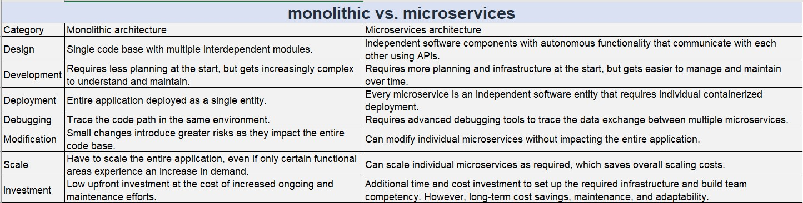

# Principles of Microservices Architecture

Microservices architecture is an architectural style that structures an application as a collection of loosely coupled services. Each service is highly maintainable, testable, independently deployable, and organized around business capabilities. Here are the key principles of microservices architecture:

1. Single Responsibility Principle

Each microservice should have a single, well-defined purpose and should perform one specific function or a small group of related functions. This helps to ensure that services remain small, manageable, and focused.

2. Decentralized Data Management

Microservices favor decentralized data management, meaning each service manages its own database. This avoids the complexities and performance issues associated with a single, centralized database.

3. Independent Deployability

Microservices can be developed, deployed, and scaled independently. This allows for continuous deployment and faster iterations since changes to one service do not require the redeployment of the entire application.

4. API-based Communication

Services communicate with each other through well-defined APIs, typically over HTTP/REST or messaging queues. This ensures clear, decoupled interactions between services.

5. Decentralized Governance

Microservices architecture supports decentralized governance, allowing teams to choose the best tools and technologies for their specific needs. This encourages innovation and the use of the right tool for the right job.

6. Automated Deployment and DevOps

Automated deployment processes and DevOps practices are essential for managing microservices. Continuous integration and continuous deployment (CI/CD) pipelines help streamline the deployment process, reduce errors, and improve deployment frequency.

7. Failure Isolation

Microservices are designed to handle failure gracefully. The failure of one service should not impact the entire system. Techniques such as circuit breakers, retries, and failover mechanisms are often used to achieve this.

8. Polyglot Programming

Microservices architecture allows the use of different programming languages, frameworks, and technologies for different services. This flexibility enables teams to use the best tools for their specific needs.

9. Business Capability Alignment

Each microservice should align with a specific business capability, making it easier to evolve and scale the system in response to changing business requirements.

10. Scalability

Microservices can be scaled independently. If a particular service requires more resources due to increased demand, it can be scaled out without affecting other services.

11. Organized around Business Capabilities

Teams are cross-functional, organized around business capabilities, and own the lifecycle of the service. This aligns the development process with business objectives and improves overall efficiency.

12. Event-Driven Architecture

Microservices often use event-driven architecture for asynchronous communication between services. This can improve performance and resilience by decoupling services and enabling them to react to events in real-time.
