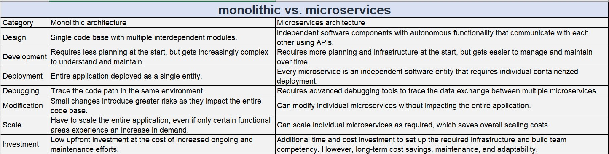

# Principles of Microservices Architecture

Microservices architecture is an architectural style that structures an application as a collection of loosely coupled services. Each service is highly maintainable, testable, independently deployable, and organized around business capabilities. Here are the key principles of microservices architecture:

1. Single Responsibility Principle

Each microservice should have a single, well-defined purpose and should perform one specific function or a small group of related functions. This helps to ensure that services remain small, manageable, and focused.

2. Decentralized Data Management

Microservices favor decentralized data management, meaning each service manages its own database. This avoids the complexities and performance issues associated with a single, centralized database.

3. Independent Deployability

Microservices can be developed, deployed, and scaled independently. This allows for continuous deployment and faster iterations since changes to one service do not require the redeployment of the entire application.

4. API-based Communication

Services communicate with each other through well-defined APIs, typically over HTTP/REST or messaging queues. This ensures clear, decoupled interactions between services.

5. Decentralized Governance

Microservices architecture supports decentralized governance, allowing teams to choose the best tools and technologies for their specific needs. This encourages innovation and the use of the right tool for the right job.

6. Automated Deployment and DevOps

Automated deployment processes and DevOps practices are essential for managing microservices. Continuous integration and continuous deployment (CI/CD) pipelines help streamline the deployment process, reduce errors, and improve deployment frequency.

7. Failure Isolation

Microservices are designed to handle failure gracefully. The failure of one service should not impact the entire system. Techniques such as circuit breakers, retries, and failover mechanisms are often used to achieve this.

8. Polyglot Programming

Microservices architecture allows the use of different programming languages, frameworks, and technologies for different services. This flexibility enables teams to use the best tools for their specific needs.

9. Business Capability Alignment

Each microservice should align with a specific business capability, making it easier to evolve and scale the system in response to changing business requirements.

10. Scalability

Microservices can be scaled independently. If a particular service requires more resources due to increased demand, it can be scaled out without affecting other services.

11. Organized around Business Capabilities

Teams are cross-functional, organized around business capabilities, and own the lifecycle of the service. This aligns the development process with business objectives and improves overall efficiency.

12. Event-Driven Architecture

Microservices often use event-driven architecture for asynchronous communication between services. This can improve performance and resilience by decoupling services and enabling them to react to events in real-time.

---

Querying data from multiple databases in a microservices architecture can be challenging due to the decentralized data management principle. However, several strategies and patterns can be employed to effectively query and aggregate data from multiple microservices:

**1. API Composition**
API Composition involves an API gateway or a dedicated service that calls multiple microservices and aggregates the results. This approach is suitable for simple aggregations and read operations.

- API Gateway: Acts as a single entry point for client requests, orchestrating calls to multiple microservices and aggregating the results.
- Backend for Frontend (BFF): A specific type of API gateway tailored to the needs of a particular client interface.
```
@RestController
public class CompositeController {
    
    @Autowired
    private ServiceAClient serviceAClient;
    
    @Autowired
    private ServiceBClient serviceBClient;
    
    @GetMapping("/composite")
    public CompositeResponse getCompositeData() {
        DataA dataA = serviceAClient.getDataA();
        DataB dataB = serviceBClient.getDataB();
        return new CompositeResponse(dataA, dataB);
    }
}
```

**2. Database Per Service with Data Replication**

Each microservice owns its own database, but certain data can be replicated across services to reduce the need for cross-service queries.

- Event-Driven Data Replication: Use an event-driven architecture to replicate data between services. Services publish events when their data changes, and other services subscribe to these events to update their own data stores.

```
// Service A publishes an event
public void updateDataA(DataA dataA) {
    dataRepository.save(dataA);
    eventPublisher.publishEvent(new DataAUpdatedEvent(dataA));
}

// Service B listens for the event
@EventListener
public void handleDataAUpdated(DataAUpdatedEvent event) {
    dataBRepository.updateWithDataA(event.getDataA());
}
```
**3. CQRS (Command Query Responsibility Segregation)**

CQRS separates the read and write operations, allowing for optimized data retrieval and updates. Read models can aggregate data from multiple sources.

- Command Side: Handles write operations.
- Query Side: Handles read operations, often using a different data model optimized for queries.

```
// Command Handler
public class CreateOrderCommandHandler {
    public void handle(CreateOrderCommand command) {
        // Handle command logic
    }
}

// Query Handler
public class OrderQueryHandler {
    public OrderDTO getOrder(String orderId) {
        // Retrieve data from multiple sources and aggregate
        Order order = orderRepository.findById(orderId);
        Customer customer = customerRepository.findByOrderId(orderId);
        return new OrderDTO(order, customer);
    }
}
```
4. Database Views and Joins
In some cases, you can use database views or federated queries to aggregate data from multiple databases, especially if using a multi-model database that supports such operations.

Federated Queries: Queries that span multiple databases, often used in data warehousing.

5. GraphQL
GraphQL can be used as an API layer to aggregate data from multiple microservices. It allows clients to request exactly the data they need and can efficiently compose data from multiple sources.

Note : Querying data from multiple databases in a microservices architecture requires careful planning and design. The choice of strategy depends on the specific requirements, such as the need for real-time data, the complexity of the queries, and the consistency requirements. Using a combination of API composition, data replication, CQRS, federated queries, and GraphQL can help achieve efficient and scalable data retrieval across multiple microservices.

---
# Bounded Contexts in Microservices

Bounded contexts are a core concept in Domain-Driven Design (DDD) and play a crucial role in the architecture of microservices. They help in defining clear boundaries within which a particular domain model is valid and consistent, ensuring that each microservice has a well-defined scope and responsibility.

A bounded context represents a specific responsibility and area of a larger domain. Within a bounded context, all models, logic, and data are consistent and follow the same rules. It helps to avoid ambiguity and conflicts that might arise from having multiple models and interpretations of the same concepts in different parts of the system.

**Benefits of Bounded Contexts in Microservices**

Clear Boundaries: Ensures that each microservice has a clear, well-defined responsibility.

Modularity: Promotes modularity and independence between services, allowing easier maintenance and scalability.

Consistency: Maintains consistency within each bounded context by avoiding the overlap of domain logic and data.

Decoupling: Encourages loose coupling between different parts of the system, making the overall architecture more flexible and resilient to changes.

**Bounded Contexts in a Banking Trading System**

In a banking trading system, the application can be divided into several bounded contexts, each representing a distinct area of functionality. Here are some examples of bounded contexts:

1. Trade Execution Context:

Responsibility: Handling the execution of trades.

Entities: Trade, Order, ExecutionReport.

Services: TradeExecutionService, OrderService.

2. Risk Management Context:

Responsibility: Managing risk associated with trades.

Entities: RiskAssessment, Position, Exposure.

Services: RiskAssessmentService, PositionService.

3. Settlement Context:

Responsibility: Settling trades after execution.

Entities: Settlement, Payment, Ledger.

Services: SettlementService, PaymentService.

4. Market Data Context:

Responsibility: Providing market data such as prices and rates.

Entities: MarketData, Price, Rate.

Services: MarketDataService, PriceService.

5. Compliance Context:

Responsibility: Ensuring trades comply with regulatory requirements.

Entities: ComplianceCheck, Report, AuditTrail.

Services: ComplianceService, ReportingService.

Interactions Between Bounded Contexts

Each bounded context operates independently but may need to interact with other contexts. This interaction is typically managed through well-defined APIs or asynchronous messaging (events).

Example Interaction:

Trade Execution and Risk Management:

When a trade is executed, the TradeExecutionService publishes a TradeExecutedEvent.

The RiskAssessmentService subscribes to this event to assess the risk of the new trade.

Trade Execution Context:
```
public class TradeExecutionService {
    private final TradeRepository tradeRepository;
    private final EventPublisher eventPublisher;

    public TradeExecutionService(TradeRepository tradeRepository, EventPublisher eventPublisher) {
        this.tradeRepository = tradeRepository;
        this.eventPublisher = eventPublisher;
    }

    public void executeTrade(Trade trade) {
        tradeRepository.save(trade);
        eventPublisher.publish(new TradeExecutedEvent(trade));
    }
}
```
Risk Management Context:
```
public class RiskAssessmentService {
    private final PositionRepository positionRepository;
    private final RiskCalculator riskCalculator;

    @EventListener
    public void handleTradeExecuted(TradeExecutedEvent event) {
        Trade trade = event.getTrade();
        Position position = positionRepository.findByTrade(trade);
        riskCalculator.calculateRisk(position);
    }
}
```

